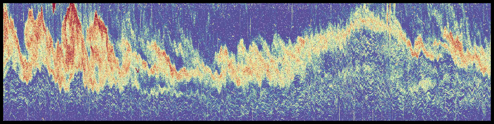
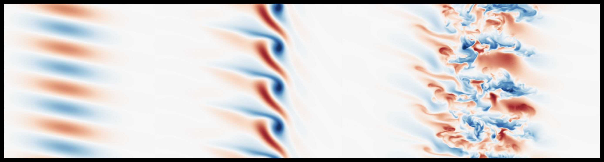

## Ongoing Projects

### Characterising buoyancy-driven flows in coastal seas
*With [Jack McSweeney](https://jmcsweeney34.com/) (Stony Brook University)*

  

  

    Shoaling internal waves are key drivers of variability in coastal oceans. Working with data from the
    <a href="https://journals.ametsoc.org/view/journals/bams/102/5/BAMS-D-19-0281.1.xml">Inner Shelf Dynamics Experiment</a>
    alongside theory and numerical models, we are interested in characterizing and modelling key features of breaking internal
    waves (for example, turbulent scalar and momentum fluxes, and diapycnal mixing). We are finding that the turbulent dynamics are
    sensitive to properties of the flow over a wide range of scales: see our latest
    <a href="https://essopenarchive.org/doi/full/10.22541/essoar.173687392.29381789">preprint</a>
    if you want to know more.
  

### Internal wave-mean flow interactions
#### With [Miles Couchman](https://www.yorku.ca/professor/couchman/) (York University) and Arun Balakrishna (Stanford University)

Following on from work conducted during my [PhD](https://www.repository.cam.ac.uk/items/2b1f13f0-e1a4-4ad0-bfe2-058f821689b1), many important properties of sratified turbulent mixing are sensitive to the mechanisms by which small-scale turbulence extracts kinetic and potential energy from larger-scale motions. This can lead to significant deviations away from a commonly assumed turbulent stationary state maintained by vertical shear production. Together with [Miles Couchman](https://www.yorku.ca/professor/couchman/), we are conduting direct numerical simulations to investigate the curious behaviour of internal wave packets that are refracted by, and eventually break within, a stratified horizontal shear layer. This work was initiated at the [Stanford CTR Summer Program 2024](https://ctr.stanford.edu/summer-program): check out some preliminary results in the program proceedings [here](https://web.stanford.edu/group/ctr/ctrsp24/vi09_LEWIN.pdf).

 

### Implicit large eddy simulation for stratified and buoyancy-driven flows
#### With Anant Ayyar (now CU Boulder)

 

### Secondary shear instabilities in interfacial flows
#### With Emma Bouckley (University of Cambridge) and [Adrien Lefauve](https://www.alefauve.com/) (Imperial College London)
