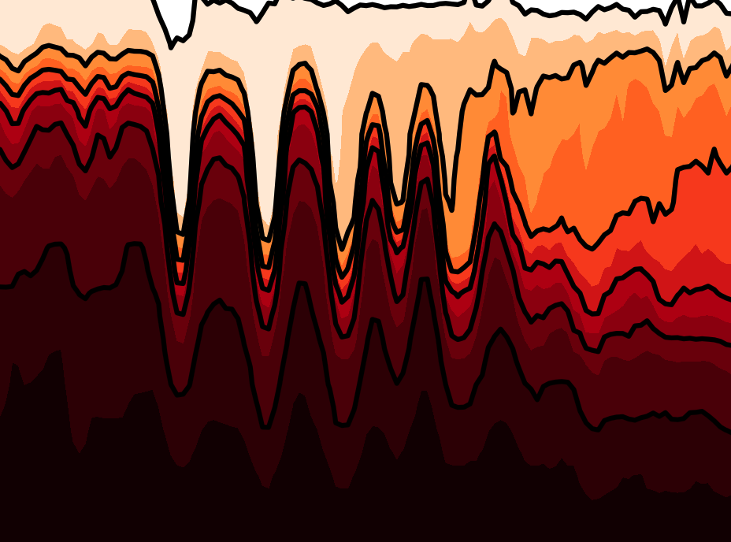
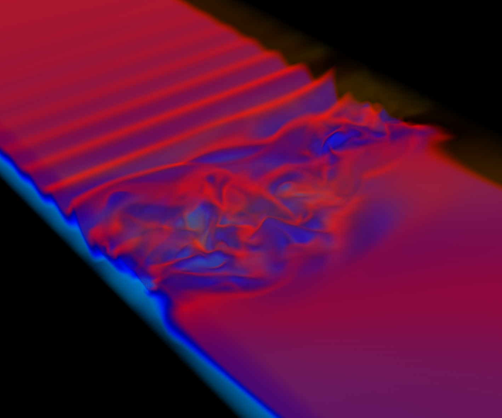
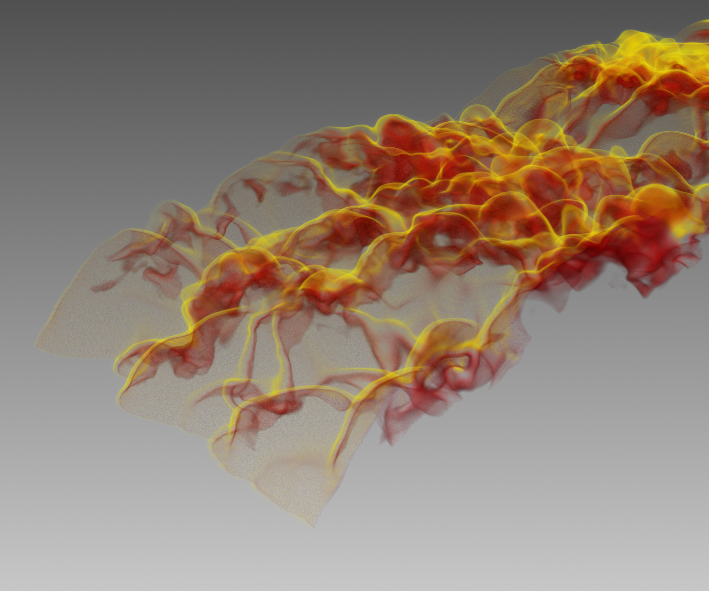
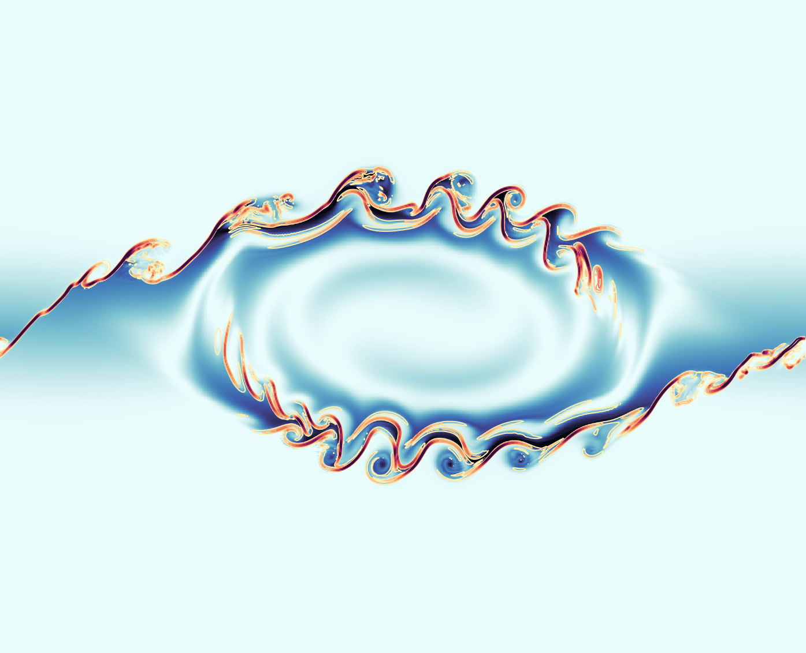

## Ongoing Projects

### Buoyancy-driven flows in coastal seas

  
  

  In coastal seas, flows driven by horizontal heat and/or salinity differences interact with ambient stratification and shear, resulting in complex nonlinear dynamics. How can we characterise these processes and model the transport and mixing they facilitate?
  

  
_With [Jack McSweeney](https://jmcsweeney34.com/) (Stony Brook University)_

### Internal wave-mean flow interactions

  
  

A significant portion of mechanical energy in the ocean is stored in and transported by internal gravity waves. How do these waves exchange energy and momentum with background currents, and how do these exchanges lead to instability and wave-breaking? 
  

  
_With [Miles Couchman](https://www.yorku.ca/professor/couchman/) (York University) and Arun Balakrishna (Stanford University)_

 
### Implicit large eddy simulation (ILES) for stratified interfacial flows

  

ILES is a large eddy simulation approach for finite volume numerics in which dissipation is entirely numerical and provided by the chosen advection scheme (for example, a Weighted, Essentially Non-Oscillatory (WENO) scheme). How effectively does it capture properties of mixing in flows with sharp density and velocity interfaces, such as gravity currents?

 
_With Anant Ayyar (now CU Boulder)_

 

### Secondary shear instabilities in Kelvin-Helmholtz billows

  

Billow-like vortices produced by Kelvin-Helmholtz instability are commonly observed in the natural environment, though our ability to model the subsequent pathways to turbulence are restricted by the range of Reynolds numbers that are accessible computationally. What are the dynamics leading to the formation of secondary instabilities in the large Reynolds number limit?

  
_With Emma Bouckley (University of Cambridge) and [Adrien Lefauve](https://www.alefauve.com/) (Imperial College London)_
